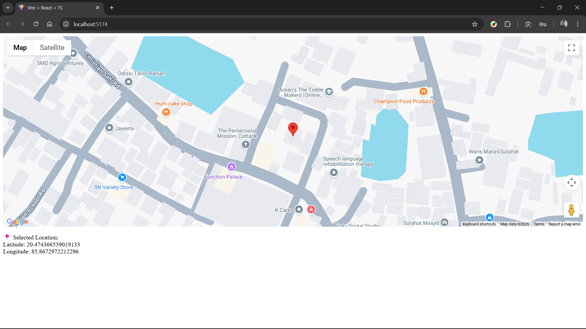

# React Google Maps Marker

A simple React application that integrates Google Maps API to display an interactive map where users can place markers by clicking on locations.

## Screenshot

## Setup

1. Clone this repository
2. Install dependencies: `npm install`
3. Get your Google Maps API key from the [Google Cloud Console](https://console.cloud.google.com/) (enable Maps JavaScript API)
4. Copy `.env.example` to `.env` and add your Google Maps API key
5. Run the development server: `npm run dev`